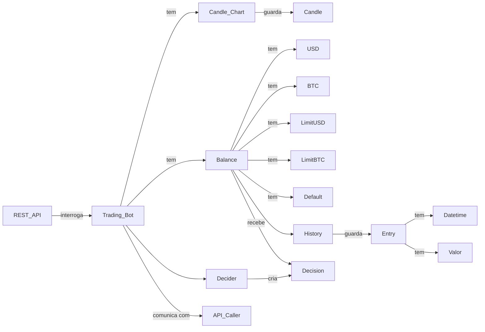
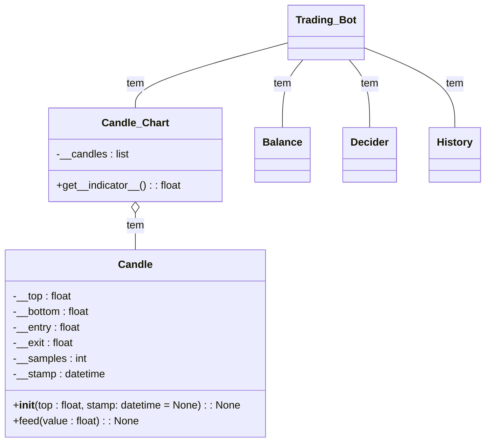

# Trading Bot em BTC

O api_caller deverá obter informações acerca de candles passadas ou do valor atual da moeda.

A candle deverá armazenar essas informações, e, no caso da
captura de uma vela, deverá oferecer uma função feed() capaz de ir recebendo os valores da moeda e indo atualizando a estrutura.

A candle_chart deverá ir armazenando as candles e fornecer e calcular os indicadores quando necessário. Deverá também oferecer todos os indicadores sobre o formato de uma matriz.

> !NOTE: ÉS UM GÉNIO, A MATRIZ VAI DAR PARA DAR PLUG NA REDE NEURAL!!!!!!

O history deverá armazenar os histórico de 'jogadas do bot' (entry). Um entry regista uma transação (vender ou comprar), a data e hora em que foi feita e o valor da moeda no momento.

A balance deverá guardar o estado financeiro do bot, assim como os limites de gasto e o valor de aposta padrão.

A decision deverá ser a decisão tomada e o multiplier.

